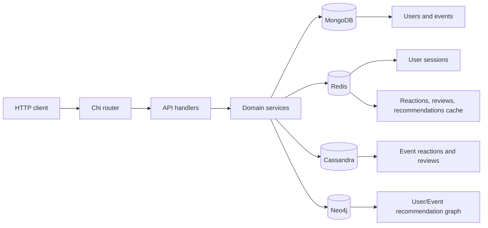
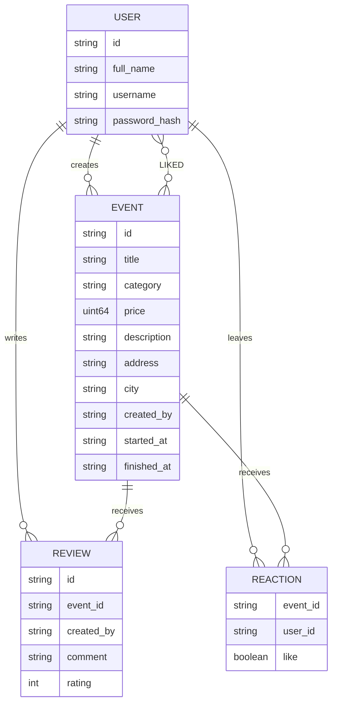
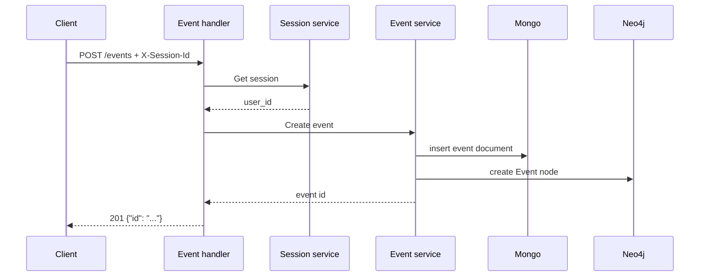

# EventHub


EventHub - backend API для публикации и поиска мероприятий. Сервис хранит пользователей и события, поддерживает сессии, реакции, отзывы и персональные рекомендации.

## Технологический стек

| Компонент | Технология | Назначение |
| --- | --- | --- |
| Язык | Go 1.26 | Backend-сервис |
| HTTP | go-chi/chi v5, go-chi/render | Роутинг, middleware, JSON-ответы |
| Конфигурация | godotenv | Загрузка `.env.local` |
| Основное хранилище | MongoDB 8.0 | Пользователи, мероприятия, индексы и шардирование |
| Сессии и кэш | Redis 8.0 | Cookie-сессии, кэш реакций, отзывов и рекомендаций |
| Wide-column storage | Cassandra 5.0 | Реакции и отзывы к мероприятиям |
| Graph DB | Neo4j 5.26 | Граф лайков для рекомендаций |
| Контейнеризация | Docker, Docker Compose | Локальный запуск приложения и инфраструктуры |

## Архитектура проекта

```text
cmd/                              точка входа приложения
internal/api/                     HTTP handlers и router
internal/app/                     сборка зависимостей приложения
internal/config/                  чтение и валидация env-конфигурации
internal/service/                 бизнес-логика
internal/infrastructure/mongo/    MongoDB repositories
internal/infrastructure/redis/    Redis session/cache repositories
internal/infrastructure/cassandra Cassandra repositories для реакций и отзывов
internal/infrastructure/neo4j     Neo4j graph adapter
internal/transport/               общий формат HTTP-ответов
api/openapi.yaml                  OpenAPI 3.0 спецификация
scripts/                          init-скрипты Cassandra и Neo4j
```

### Компоненты



### Основные сущности



### Запрос создания мероприятия



## Функциональные требования и use cases

- Пользователь может зарегистрироваться, получить cookie `X-Session-Id`, войти и выйти из системы.
- Гость может просматривать пользователей, мероприятия и отзывы.
- Авторизованный пользователь может создать мероприятие.
- Организатор может обновить категорию, цену и город своего мероприятия.
- Авторизованный пользователь может поставить лайк или дизлайк мероприятию.
- Авторизованный пользователь может оставить и изменить отзыв с рейтингом.
- Пользователь может получить рекомендации на основе графа связей `User` -> `LIKED` -> `Event`.
- Списки поддерживают фильтрацию и пагинацию: `limit`, `offset`, `title`, `category`, `city`, `price_from`, `price_to`, `date_from`, `date_to`.

## API

OpenAPI-спецификация лежит в [api/openapi.yaml](api/openapi.yaml). Ее можно открыть в Swagger UI, Redoc или в IDE с поддержкой OpenAPI.

Локальный Swagger UI через Docker:

```sh
docker run --rm -p 8090:8080 -e SWAGGER_JSON=/api/openapi.yaml -v "$PWD/api:/api" swaggerapi/swagger-ui
```

После запуска UI будет доступен на `http://localhost:8090`.

Примеры запросов и ответов включены в OpenAPI-файл. Основные группы эндпоинтов:

- `GET /health`, `POST /session` - healthcheck и гостевая сессия.
- `POST /users`, `GET /users`, `GET /users/{id}`, `GET /users/{id}/events` - пользователи.
- `POST /auth/login`, `POST /auth/logout` - авторизация.
- `POST /events`, `GET /events`, `GET /events/{id}`, `PATCH /events/{id}` - мероприятия.
- `POST /events/{id}/like`, `POST /events/{id}/dislike` - реакции.
- `POST /events/{id}/reviews`, `GET /events/{id}/reviews`, `PATCH /events/{id}/reviews/{review_id}` - отзывы.
- `GET /recommendations` - рекомендации для текущего пользователя.

## Инструкция по запуску

1. Проверьте значения в `.env.local`.
2. Запустите приложение и инфраструктуру:

```sh
make run
```

4. Проверьте состояние контейнеров:

```sh
make ps
```

5. Проверьте API:

```sh
curl http://localhost:8080/health
```

Полезные команды:

```sh
make logs            # логи всех контейнеров
make stop            # остановить контейнеры
make clean           # остановить контейнеры и удалить volumes
make compose-config  # проверить итоговый docker-compose config
```

## Конфигурация

| Переменная | Описание | Значение по умолчанию в `.env.local` |
| --- | --- | --- |
| `APP_PORT` | Порт HTTP API | `8080` |
| `APP_HOST` | Host приложения для локальных сценариев | `localhost` |
| `APP_BIND_IP` | IP, на который публикуются Docker-порты | `127.0.0.1` |
| `APP_USER_SESSION_TTL` | TTL пользовательской сессии в секундах | `60` |
| `APP_LIKE_TTL` | TTL кэша реакций в секундах | `60` |
| `APP_EVENT_REVIEWS_TTL` | TTL кэша агрегированных отзывов | `120` |
| `APP_RECOMMENDATIONS_TTL` | TTL кэша рекомендаций | `60` |
| `REDIS_HOST` | Host Redis | `redis` |
| `REDIS_PORT` | Порт Redis | `6379` |
| `REDIS_PASSWORD` | Пароль Redis, пустое значение отключает auth | пусто |
| `REDIS_DB` | Номер Redis DB | `0` |
| `MONGODB_DATABASE` | База MongoDB | `eventhub` |
| `MONGODB_HOST` | Host Mongo router | `mongos` |
| `MONGODB_PORT` | Порт Mongo router | `27017` |
| `MONGO_CONFIGSVR_PORT` | Внутренний порт config servers | `27019` |
| `MONGO_SHARD_PORT` | Внутренний порт shard servers | `27018` |
| `MONGO_ROUTER_PORT` | Порт mongos | `27017` |
| `CASSANDRA_HOSTS` | Cassandra hosts через запятую | `cassandra-test` |
| `CASSANDRA_PORT` | Cassandra native transport port | `9042` |
| `CASSANDRA_KEYSPACE` | Keyspace для реакций и отзывов | `testkeyspace` |
| `CASSANDRA_CONSISTENCY` | Consistency level | `ONE` |
| `NEO4J_URL` | Bolt URL Neo4j | `bolt://neo4j:7687` |
| `NEO4J_USERNAME` | Пользователь Neo4j | `neo4j` |
| `NEO4J_PASSWORD` | Пароль Neo4j | `password` |
| `NEO4J_HTTP_PORT` | HTTP-порт Neo4j browser | `7474` |
| `NEO4J_BOLT_PORT` | Bolt-порт Neo4j | `7687` |

## Проверка

Проект проверяется автотестами в GitHub Actions. Workflow лежит в `.github/workflows/eventhub.yml`: он читает номер лабораторной из `.labrc`, затем запускает reusable workflow `sitnikovik/ndbx/.github/workflows/eventhub.yml@main`.

Проверка запускается автоматически при `push` и `pull_request` в ветку `main`, а также вручную через `workflow_dispatch`. Сами автогрейдеры находятся в репозитории задания: <https://github.com/sitnikovik/ndbx/tree/main/autograder>.
